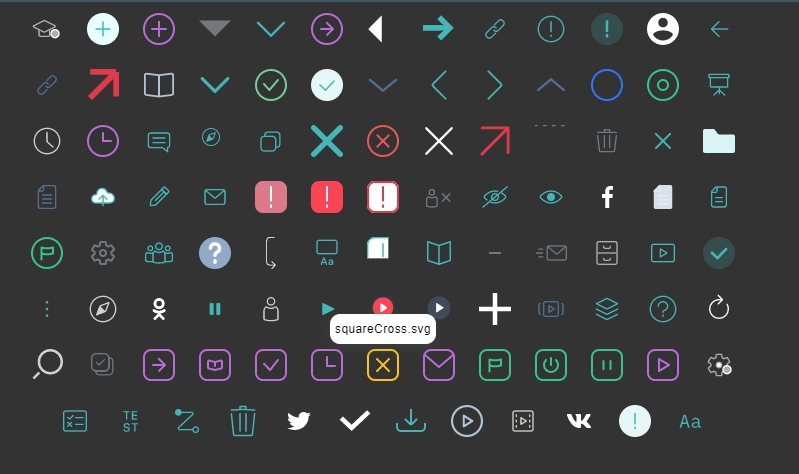

# vue-svg-kit

Demo url: https://dmtk.space/vue-svg-kit/](https://dmtk.space/vue-svg-kit/)



View all svg icons from assets/svg directory


## Project setup
```
yarn install
```

### Compiles and hot-reloads for development
```
yarn serve
```

### Compiles and minifies for production
```
yarn build
```

### Lints and fixes files
```
yarn lint
```

### Customize configuration
See [Configuration Reference](https://cli.vuejs.org/config/).
